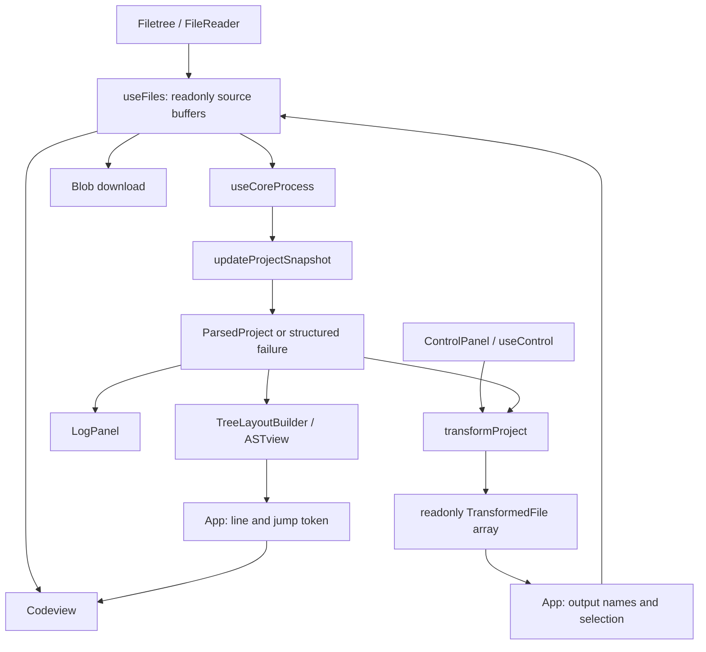

# Website architecture

This document describes the website using `@preptex/core@0.2.1`. Update it when
component responsibilities, state ownership, or the integration contract change.

## Scope and dependencies

This is a client-only React application. It loads virtual files, displays LaTeX
source and its AST, applies PrepTeX transforms, and downloads text. There is no
backend, persistence service, TeX compiler, PDF renderer, or network file service.
Files live in memory; only AST filter preferences persist in browser localStorage.

Runtime dependencies are React 19, CodeMirror 6, and PrepTeX Core 0.2.1.
The existing build system is Create React App 5 with TypeScript 4.9 and Webpack 5.
TypeScript uses ES2020, strict checking, checked indexed access, and Node module
resolution compatible with that compiler. Explicit `any` is an ESLint error.
Jest transforms the ESM PrepTeX package and CodeMirror's ESM
`@marijn/find-cluster-break` dependency.

## Components and classes

| Component or class | Location | Responsibility |
| --- | --- | --- |
| `App` | `src/App.tsx` | Composes the panes and hooks; coordinates entry selection, generated files, downloads, tabs, AST width/collapse, and source-line navigation. |
| `Filetree` | `src/components/Filetree.tsx` | File/folder upload controls, nested folder-first listing, selection, removal, downloads, and upload failure display. |
| File tree `TreeNode` | `src/components/Filetree.tsx` | Private recursive row component; owns only folder expansion state. `buildFiletree` derives the display hierarchy from virtual paths. |
| `ControlPanel` | `src/components/ControlPanel.tsx` | Controlled form for entry/output names, input handling, comment suppression, condition evaluation, and Run. Receives the shared `CoreOptionsUI` type. |
| `CodeMirrorView` (exported as `Codeview`) | `src/components/Codeview.tsx` | Owns the imperative CodeMirror `EditorView` lifecycle. Displays a read-only document, replaces it when source changes, and jumps to a requested one-based line. |
| `ASTview` | `src/components/astview/ASTview.tsx` | Filters display nodes, manages node/command/environment preferences, and persists validated preferences. A hidden parent hides its subtree. |
| AST `TreeNode` | `src/components/astview/TreeNode.tsx` | Recursive AST rows with expansion state, labels, stars, source lines, and selection callbacks. |
| `TreeLayoutBuilder` | `src/components/astview/treebuilder.tsx` | The website's explicit adapter class: converts readonly `AstNode` values into readonly `LayoutNode` display data. Uses `isContainerNode` and exhaustive `NodeType` narrowing, including newlines. |
| `LogPanel` | `src/components/LogPanel.tsx` | Renders structured warnings and failures with severity/code, path, and line where available. |
| `LayoutNode`, `LayoutNodeKind` | `src/types/LayoutNode.ts` | Website-owned display types, separate from core syntax data; defines the valid filter kinds. |

`src/components/index.ts` provides component exports. `src/index.tsx` mounts
`App` under React StrictMode. `App.css`, `ControlPanel.css`, and `index.css`
own the existing layout and visual styling. `reportWebVitals.ts` is the optional
CRA performance reporting entry point.

## Hooks, services, and state ownership

| Hook or service | State or contract | Role |
| --- | --- | --- |
| `useFiles` | A reducer owns readonly `FilesMap`, selected path, and upload error. | Reads batches with FileReader, atomically upserts/removes buffers, and keeps selection valid. Multiple queued updates compose without losing a mutation. |
| `useControl` | `CoreOptionsUI` and `DEFAULT_CORE_OPTIONS`. | Owns the form options; uses core `InputHandlingMode` and readonly `ConditionName[]` directly. |
| `useCoreProcess` | `ProjectSnapshot` and a transform failure tied to sources, entry, and options. | Synchronizes source buffers with core snapshots, exposes diagnostics and Run availability, and returns readonly transformed files. |
| `updateProjectSnapshot` | `src/services/core.ts`; previous snapshot + current buffers → ready/error snapshot. | Parses changed files, merges successful updates, rebuilds for deletion/recovery, and normalizes parse failures. |
| `toTransformOptions` | `src/services/core.ts`; UI options → `TransformOptions`. | Keeps the condition-preservation/evaluation distinction and passes the exported input enum. |
| `toProcessingError` | `src/services/core.ts`; `unknown` → `ProcessingError`. | Preserves typed PrepTeX errors and syntax diagnostics; distinguishes unexpected failures. |

There are no service singleton classes. Browser I/O lives in the file hook and
App's download handler; the processing service is a pure adapter. Core processing
is currently synchronous on the main thread. The bundled integration guide
recommends a Web Worker for large projects; introducing one requires asynchronous
request/version tracking and error DTO serialization.

## Data flow

1. FileReader reads each upload. Folder uploads retain `webkitRelativePath`;
   separators become forward slashes. Original source text and line endings
   remain unchanged. A failed read rejects the whole batch and is shown near uploads.
2. The reducer updates source buffers and selection together. The first available
   file is selected when the project is empty; adding files preserves the current entry.
3. The processing effect constructs typed `SourceFile[]` with a monotonically
   increasing snapshot version. Only changed sources are parsed and merged into a
   successful previous snapshot. An unchanged parsed file retains core identity.
4. Core has no merge deletion operation. Removing a file rebuilds from all current
   buffers. A failed parse exposes no usable project, and the next update reparses
   all current files. A snapshot whose buffer identity is stale is never exposed
   for Run or AST display.
5. Selecting a file derives its root from `project.files`. Core IDs are unique
   only within a file; App keys the AST view by file path so row state cannot leak
   between files. A reparse can reuse IDs, so IDs must not become persistent bookmarks.
6. Run transforms the current entry and snapshot. Errors open the Log tab;
   parse errors mark the tab and disable Run. Successful outputs are added to the
   file tree and reparsed through the same path.
7. Outputs normally use `<original>.processed.tex`. The optional override applies
   only to the entry output; a name without an extension gets `.processed.tex`.
   App selects the entry output even when Separate mode sorts another file first.
   Output naming does not rewrite preserved `\input` references. Original and
   generated buffers share the same project, so subsequent Separate runs include
   previously generated files too.
8. Downloads create a Blob and revoke its object URL after triggering download.
   The UI does not write to the user's filesystem directly.

## PrepTeX integration contract

Import public values and types only from `@preptex/core`.
The installed package's declarations and documentation are authoritative:

- `node_modules/@preptex/core/dist/docs/integration.md`
- `node_modules/@preptex/core/dist/docs/architecture.md`
- `node_modules/@preptex/core/dist/docs/api/README.md`
- `node_modules/@preptex/core/dist/index.d.ts` and its public declaration re-exports

A separately supplied `packages/preptex-core` directory may also contain a
package and bundled docs. This checkout currently resolves the published package
through `node_modules/@preptex/core`; it does not require the sibling core source
repository to build. Check a supplied package's version before relying on its docs.

| Earlier integration | Current integration |
| --- | --- |
| `process` with a filename-keyed record | `parseProject(readonly SourceFile[])` |
| `combine_project` | `mergeProjects` |
| Project methods such as `getRoots()` | Plain readonly `project.files`, `declaredConditions`, and `diagnostics` |
| `transform` returning a record | `transformProject` returning `TransformResult.files` |
| `InputCmdHandling.NONE / FLATTEN / RECURSIVE` | `InputHandlingMode.Preserve / Flatten / Separate` |
| `ifDecisions: Set<string>` | Optional readonly `enabledConditions` array |
| Loose node casts, `is_starred`, `delim` | Discriminated `AstNode`, `starred`, `delimiter` |
| String notes and generic exceptions | `WarningDiagnostic[]`, `PrepTexSyntaxError`, and `PrepTexError.code` |

Preserve emits the entry with literal inputs. Flatten inlines reachable inputs
and resolves paths relative to the including file. Separate emits every parsed
file independently. Omitting `enabledConditions` preserves condition syntax;
supplying `[]` evaluates every recognized condition as false. Conditions remain
case-sensitive.

Core results are deeply frozen and readonly. Never sort a core array in place,
attach view fields to a node, edit children, or cast away readonly. Keep mutable
UI state outside the AST. Source ranges use inclusive UTF-16 offsets and one-based
lines; transformed text has no source map. Reparse outputs before AST navigation.

## Errors and boundary validation

`ProcessingError` is a discriminated union:

- `syntax`: carries the original `SyntaxDiagnostic` and syntax error code.
- `core`: carries a `PrepTexErrorCode`, including missing entry/input, circular
  input, and invalid argument.
- `unexpected`: carries the message from an unknown non-PrepTeX failure.

Branch on the union/code, never parse human-readable error text. Diagnostics stay
structured until LogPanel renders them. A failed transform is associated with
its exact sources, selected entry, and options; changing those inputs hides an
obsolete failure. Successful transforms clear it.

DOM select values are narrowed with `isInputHandlingMode`. Stored JSON starts as
`unknown`, is checked for object/array/string shapes, and is filtered against
known AST kinds. Unavailable localStorage does not prevent AST inspection.

## Extending and validating

For a new control, extend the shared options type, default, and adapter, then add
a regression for its actual transformation behavior. For editable source, route
CodeMirror changes through `useFiles.upsertTextFiles`; do not mutate a parsed
project. For a new core AST variant, update the exhaustive builder and filter
kinds. Keep diagnostics typed when introducing worker transport or clickable logs.

Run `npm run typecheck`, `npm run lint`, `npm run test:ci`, and `npm run build`.
The tests cover snapshot identity and deletion, failed parse recovery, batched
React updates, uploads, transformation modes and conditions, typed errors,
AST conversion, and the main upload-to-output UI flow. Browser checks should also
cover folder uploads, AST filtering/navigation, resizing, and downloads when
changes touch those behaviors.
