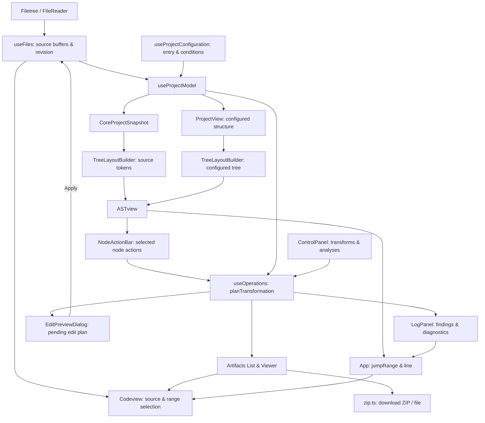

# Website architecture

This document describes the website using `@preptex/core@0.3.0`. Update it when
component responsibilities, state ownership, or the integration contract change.

## Scope and dependencies

This is a client-only React application. It loads virtual files, displays LaTeX
source, renders configured document structure or source tokens, provides independent
analyses (references, command definitions/usage), applies PrepTeX transforms, and
downloads artifacts. There is no backend, persistence service, TeX compiler, PDF renderer,
or network file service. Files live in memory; only AST filter preferences persist in
browser localStorage.

Runtime dependencies are React 19, CodeMirror 6, and PrepTeX Core 0.3.0.
The build system is Create React App 5 with TypeScript 4.9 and Webpack 5.
TypeScript uses ES2020, strict checking, checked indexed access, and Node module
resolution compatible with that compiler. Explicit `any` is an ESLint error.
Jest transforms the ESM PrepTeX package and CodeMirror's ESM
`@marijn/find-cluster-break` dependency.

## Components and classes

| Component or class | Location | Responsibility |
| --- | --- | --- |
| `App` | `src/App.tsx` | Composes the panes and hooks; coordinates entry selection, generated artifacts, downloads, tabs, AST width/collapse, structure/source viewing mode, and source-range navigation. |
| `Filetree` | `src/components/Filetree.tsx` | File/folder upload controls, nested folder-first listing, selection, removal, downloads, and upload failure display. |
| File tree `TreeNode` | `src/components/Filetree.tsx` | Private recursive row component; owns only folder expansion state. `buildFiletree` derives the display hierarchy from virtual paths. |
| `ConfigurationSummary` | `src/components/ConfigurationSummary.tsx` | Compact status bar showing configured entry, traversal policy, condition policy, and readiness badge (`Ready`, `Incomplete`, `Blocked`), with a trigger to open project settings. |
| `ProjectSetupDialog` | `src/components/ProjectSetupDialog.tsx` | Modal dialog for draft configuration: entry file selection, project vs file-only traversal, and condition policies (follow source, source with overrides, manual forcing). Opens once on first import. |
| `EditPreviewDialog` | `src/components/EditPreviewDialog.tsx` | Modal diff dialog displaying proposed source edits before apply; displays affected files, edit counts, line diff cards (`replace` vs `insert`), stale warning alerts, and provides atomic apply or discard actions. |
| `NodeActionBar` | `src/components/NodeActionBar.tsx` | Contextual action bar displayed above the AST view when an AST node is selected; offers Rename environment, Wrap in environment, and Remove node operations. |
| `ControlPanel` | `src/components/ControlPanel.tsx` | Controlled form for transformation options (input handling, comment suppression, named environment removal, conditions, Run) and independent analysis operations (`Check References`, `Check Commands`) with capability validation and artifact export. |
| `CodeMirrorView` (exported as `Codeview`) | `src/components/Codeview.tsx` | Owns the imperative CodeMirror `EditorView` lifecycle. Displays a read-only document, replaces it when source changes, and jumps to a requested one-based line or inclusive UTF-16 `jumpRange`. |
| `ASTview` | `src/components/astview/ASTview.tsx` | Displays configured structure or source token syntax, toggles structure/source mode, filters display nodes, hosts `NodeActionBar`, and persists validated preferences. |
| `AST TreeNode` | `src/components/astview/TreeNode.tsx` | Recursive AST rows with expansion state, labels, icons, source lines, ranges, and selection callbacks. |
| `TreeLayoutBuilder` | `src/components/astview/treebuilder.tsx` | Converts readonly `AstNode`, `ConfiguredNode`, or `SourceToken[]` values into readonly `LayoutNode` display data. |
| `LogPanel` | `src/components/LogPanel.tsx` | Renders structured warnings, errors, and independent `AnalysisFinding` items with severity, code, stale indicators, and jump links. |
| `LayoutNode`, `LayoutNodeKind` | `src/types/LayoutNode.ts` | Website-owned display types, separate from core syntax data; includes `range`, `path`, `occurrenceKey`, and `token` kind. |

## Hooks, services, and state ownership

| Hook or service | State or contract | Role |
| --- | --- | --- |
| `useFiles` | Reducer owning `FilesMap`, `sourceRevision`, `fileVersions`, selected path, and upload errors. | Atomically upserts/removes source buffers; increments `sourceRevision` on buffer mutations; applies edit plans atomically across files. |
| `useProjectConfiguration` | `ProjectConfigurationState` (`entryPath`, `traversal`, `conditionPolicy`, `revision`). | Owns stable entry and condition policy; decoupled from currently viewed file. |
| `useProjectModel` | `ProjectModelResult` (`snapshot`, `view`, `isReady`, `detectedConditions`, `inventory`, `error`). | Derives immutable `ProjectSnapshot` from sources and `ProjectView` from snapshot + configuration. |
| `useOperations` | `OperationState` (`running`, `result`, `error`, `isStale`, `transformationRunning`, `transformationResult`, `transformationError`, `pendingEditPlan`, `artifacts`, `isEditPlanStale`). | Coordinates independent analyses (`references`, `unused-commands`) and transformations (comment suppression, environment removal, node actions, export materialization) with validation, staging, and stale invalidation. |
| `useControl` | `CoreOptionsUI` and `DEFAULT_CORE_OPTIONS`. | Owns basic pipeline options; uses core `InputHandlingMode` directly. |
| `src/services/zip.ts` | Zero-dependency PKZIP 2.0 Store format archive builder with IEEE 802.3 CRC-32 checksums and browser download helpers. | Packages generated artifacts into `.zip` archives without external compression dependencies. |
| `src/services/core.ts` | Pure adapters for `@preptex/core@0.3.0`. | Snapshot creation/updates, inventory inspection, view resolution, capabilities, analyses, edit planning, validation, materialization, and typed error mapping (`ProcessingError`). |

## Data flow



## PrepTeX integration contract

Import public values and types only from `@preptex/core`.
Authoritative references:
- `node_modules/@preptex/core/dist/docs/integration.md`
- `node_modules/@preptex/core/dist/docs/architecture.md`
- `node_modules/@preptex/core/dist/docs/api/README.md`
- `node_modules/@preptex/core/dist/index.d.ts`

Core results are deeply frozen and readonly. Never mutate core objects or cast away readonly.
Source ranges are inclusive UTF-16 offsets and one-based lines.
They are translated to CodeMirror half-open coordinates at the display boundary in `Codeview`.

## Checks

Before concluding changes, run:
```sh
npm run typecheck
npm run lint
npm run test:ci
npm run build
```
